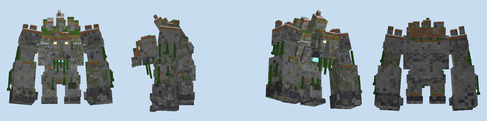
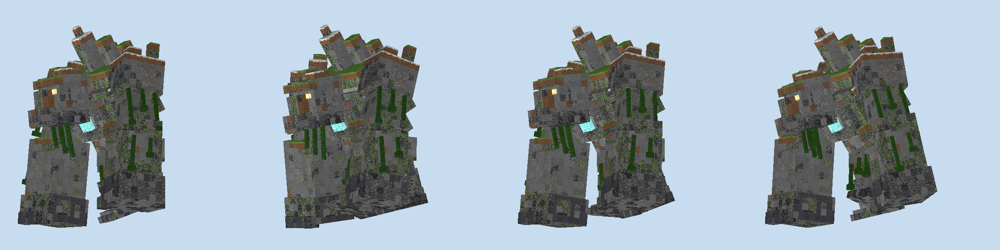
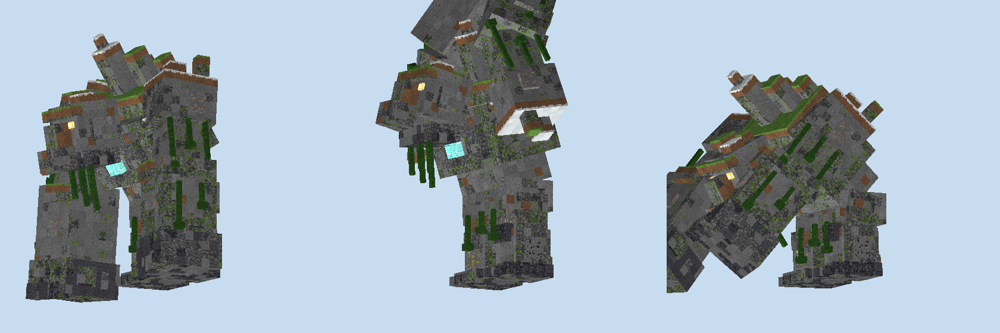
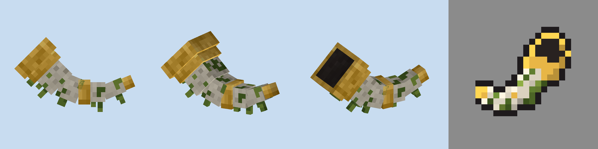
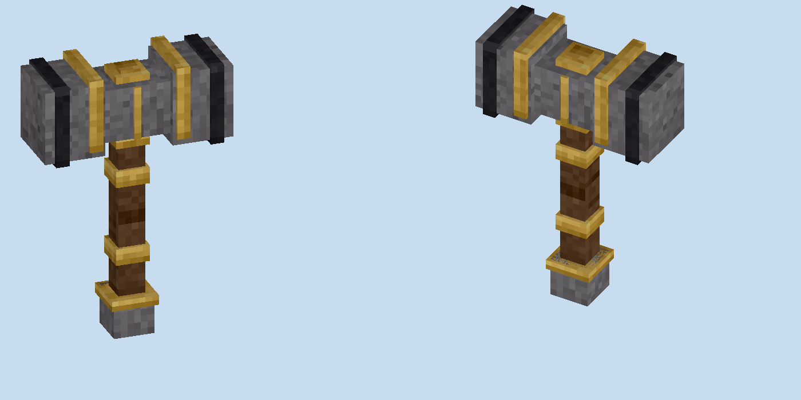
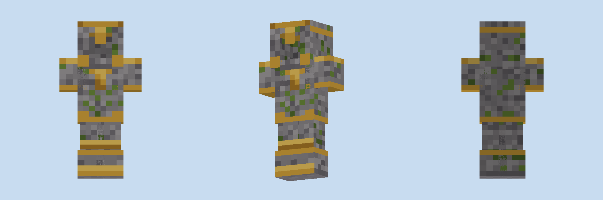

import Tooltip from "../../../components/Tooltip.astro";
import hammerIcon from "./icon-hammer.png";
import heartIcon from "./icon-heart.png";
import chestIcon from "./icon-chestplate.png";
import plateIcon from "./icon-plate.png";

Some nights the ground starts to shake. Footsteps come from somewhere past the treeline, getting louder. Then a shape twenty-eight blocks tall stands up out of the mist and starts walking. It walks in a straight line, and it does not go around anything.

By morning it's gone. What's left is a 28-block-wide scar across the plains, a few flattened houses, and whatever you managed to knock off it.

## The giant

**There is only one.** A world never has more than one Mountain Giant at a time. It turns up on about one night in three, and every quiet night makes the next one likelier; by the fourth it comes for certain. It arrives somewhere level and dry, 48 to 96 blocks from a player: plains, snowy plains or a meadow. You'll hear it about ten seconds before you see it.

**It isn't looking for you.** The giant is neutral. It walks, it tramples, and when it reaches the edge of its plains or deep water it stops, looks around, and turns back. Just don't stand next to its feet.

**It flattens things.** Everything in a 28-block-wide corridor gets pushed over: trees, fences, crops, walls. Real hills get a pass cut through them, one block up every eight. Houses get both fists brought down on them first.

**It holds a grudge, briefly.** Hit it, and it turns, roars, and comes after you. It's slower than you on foot, and it gives up after 64 blocks, at the edge of the plains, or after 45 seconds without another hit. When it does reach you, it smashes the ground in front of it for up to 20 damage.

**At dawn it leaves.** No drops, no corpse. If you want what it's carrying, you have until sunrise.

## Taking it apart

600 health, 12 armour, immune to knockback and fire. It's made of stone and ore, and it comes apart that way: every 10% of health it loses, a cluster of ore breaks off and scatters on the ground. You can see the gaps where it was.

| Health lost | Drops |
|---|---|
| 10% | 30 raw copper |
| 20% | 20 raw iron |
| 30% to 90% | 10 raw iron each time |
| Killed | 10 diamonds, the Mountain Heart, 2 Mountain Plates |

<Tooltip name="Mountain Heart" icon={heartIcon} />

## The Mountain Horn

Don't feel like waiting? Four gold blocks in the corners, mossy cobblestone on the sides and a goat horn in the middle make a Mountain Horn. Blow it deep in the night and the ground answers: tremors, distant footsteps, and then the giant rising out of the mist about 80 blocks away. The horn is never used up, but once a giant has answered it needs a full day's rest.

<Tooltip
  name="Mountain Horn"
  lines={[
    "Old bone and moss. The ground remembers its call.",
    "Blow it deep in the night to call the Mountain Giant",
    "Never used up; after an answer it rests for a day",
  ]}
/>

## The Mountain Hammer

A Mountain Heart between two iron blocks, over a stick flanked by mossy cobblestone, over another stick.

<Tooltip
  name="Mountain Hammer"
  icon={hammerIcon}
  lines={[
    "Forged around the heart of a fallen giant.",
    "Digs like the best pickaxe, 3x3 (sneak for one block)",
    "Hold right click, then release: Giant's Slam",
    "With a shield in the off hand: sneak + right click to slam",
    "",
    "When in Main Hand:",
    { text: " 11 Attack Damage", tone: "green" },
    { text: " 1 Attack Speed", tone: "green" },
  ]}
/>

**Three by three.** It digs a 3×3 square across whatever face you hit, at speed 12 (netherite is 9). Blocks harder than the one you aimed at are left alone, so hitting stone won't take the obsidian next to it.

**Giant's Slam.** Hold right click to lift the hammer over your head. After a second it locks in with a heavy clunk. Let go and a shockwave rolls out in three rings: about 12 damage within 3 blocks, 9 out to 5.5, and 6 out to 8, throwing everything outward. It doesn't hurt you and doesn't break blocks.

## Mountain armour

Each giant sheds two Mountain Plates. On a smithing table, a plate, a piece of netherite armour and a gold ingot make the Mountain version of that piece. Enchantments and wear carry over. Two giants' worth of plates is a full set, and in a full set nothing knocks you back.

<Tooltip
  name="Mountain Chestplate"
  icon={chestIcon}
  lines={[
    "Full set: immune to knockback",
    "",
    "When on Body:",
    { text: "+9 Armor", tone: "blue" },
    { text: "+3.5 Armor Toughness", tone: "blue" },
    { text: "+1.5 Knockback Resistance", tone: "blue" },
  ]}
/>

| | Netherite | Mountain |
|---|---|---|
| Armour, full set | 20 | 24 |
| Toughness per piece | 3 | 3.5 |
| Knockback resistance per piece | 0.1 | 0.15 |
| Durability | | about 15% more |

<Tooltip name="Mountain Plate" icon={plateIcon} />
